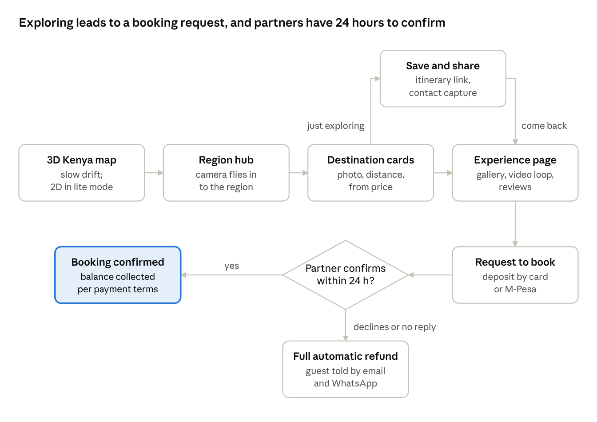
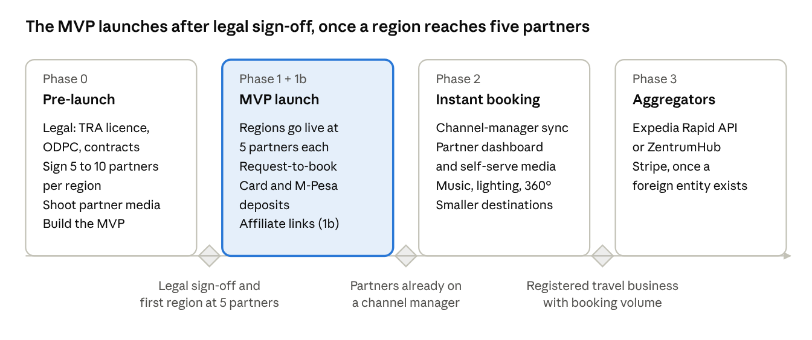

# Safarinet: Product Requirements Document

Kenya 3D Tourism Platform · Oct 6, 2026 · @thadeus

## Overview

Safarinet is an immersive 3D map of Kenya. Travellers explore regions, get a feel for each place, and book local experiences, plus the stays and trips around them, in one flow. They can pay by card or M-Pesa.

**Problem.** Travellers can't easily picture an unfamiliar country, and search-first booking sites assume they already know where to go. Much of Kenya's experience inventory isn't online: operators take bookings over WhatsApp, phone or spreadsheets.

**The bet.** For a trip people can't yet picture, discovery beats search. The site opens with the country, not a search box. The 3D map earns attention and shares, and photos, video and reviews close the sale.

**Where we win.** Kenyan experiences from local operators: game drives, guided walks, cultural visits and day trips. Booking.com and Airbnb sell rooms well, but they don't carry this inventory.

## Goals, non-goals and success metrics

The MVP has to prove that people who explore the map go on to book.

**Goals**

1. Launch across Kenya's six major regions, each with 5 to 10 hand-signed experience partners.
2. Turn map exploration into saved places and booking requests.
3. Get partners to confirm requests reliably within 24 hours.
4. Take payment by card (USD) and M-Pesa (KES) from day one.

**Non-goals for the MVP**

- Competing with Booking.com or Airbnb on standalone rooms
- Instant booking or live availability sync
- Partner self-serve onboarding
- Destinations outside the six launch regions

**Success metrics**

| Metric | Definition | Target |
| --- | --- | --- |
| Map-to-intent rate (primary) | Share of map sessions that save a place or send a booking request | Open: set before launch |
| Partner confirmation rate | Share of requests confirmed by partners within 24 hours | Open: set before launch |
| Request-to-paid conversion | Share of confirmed requests where the deposit settles | Open |
| Return rate from saves | Share of saved or shared itineraries that bring a visitor back | Open |
| Lite-mode load time | Time to an interactive map on a mid-range Android over 3G | Open |

Targets are left open because the brief doesn't set them. They should be agreed before launch.

## Target users

The MVP is designed for international visitors and the diaspora. Domestic tourists are served from day one through lite mode and M-Pesa.

| Segment | Priority | Pays with | Device | Books | Fit for 3D map |
| --- | --- | --- | --- | --- | --- |
| International tourist | Primary | Card (USD) | Laptop, iPhone, Wi-Fi | Weeks to months ahead | Strong: helps them picture an unfamiliar place |
| Diaspora and expats | Primary | Card or M-Pesa | Mixed | Holidays, family trips | Strong: nostalgia and sharing |
| Domestic Kenyan | Secondary | M-Pesa | Mid-range Android, limited data | Last-minute weekends, price-led | Weak: costs data, so lite mode matters most |

**Partners** are the second user group: tour and experience operators, plus a few lodges. Many take bookings over WhatsApp or phone. At launch they get booking requests by WhatsApp or email and confirm or decline them. The team onboards them by hand.

**Products, in priority order**

1. Experiences and tours: game drives, guided walks, cultural visits, day trips and activities
2. Multi-day trips built from those experiences plus a partner lodge
3. Standalone rooms, only where an experience partner also sells them

## Scope

All six major regions launch at once. A region goes live only once it has at least 5 confirmed partners. Until then its pin shows "coming soon".

| In the MVP | Deferred |
| --- | --- |
| 3D terrain map of Kenya, all major regions | Smaller destinations outside the launch regions |
| Destination cards: photo, distance, "from KES / USD" price | Region music crossfades |
| Experience pages (plus partner lodges): gallery, short video loop, reviews | Time-of-day lighting |
| Request-to-book with a card or M-Pesa deposit | 360° photos |
| Save places and share an itinerary link | Instant booking and channel-manager sync |
| Email or WhatsApp capture | Expedia or aggregator inventory |
| Lite mode (flat 2D map) | Partner self-serve dashboard |

**Launch regions**

| Region | Example experiences |
| --- | --- |
| Nairobi | National Park drives, Giraffe Centre, Karen, food and nightlife tours |
| Maasai Mara | Game drives, balloon safaris, Maasai village visits |
| Coast: Mombasa, Diani, Lamu | Old Town walks, snorkelling, dhow trips |
| Tsavo / Voi | Tsavo East and West drives, Lugard Falls, Mudanda Rock |
| Naivasha | Boat rides, Hell's Gate cycling, Crescent Island walks |
| Nanyuki / Mt Kenya | Hikes, Ol Pejeta visits, equator stops |

Launching everywhere makes the map feel complete, but it spreads partner recruitment thin. The 5-partner go-live rule is how we manage that.

## User flow

The design has two layers: 3D terrain for the country and its regions, and standard photo-led pages for anything a person books.

The save-and-share loop catches people who are only exploring, so they come back instead of booking elsewhere. Lite mode keeps the same pins and cards on a flat 2D map.

## Functional requirements

Every requirement below is in the MVP. P0 blocks launch; P1 should ship at launch but can slip by a few weeks.

| ID | Area | Requirement | Priority |
| --- | --- | --- | --- |
| MAP-1 | 3D map | The landing view is a 3D terrain map of Kenya that drifts slowly, with a pin for each launch region | P0 |
| MAP-2 | 3D map | Tapping a region flies the camera into a region hub | P0 |
| MAP-3 | 3D map | Regions with fewer than 5 confirmed partners show a "coming soon" pin that can't be booked | P0 |
| MAP-4 | 3D map | All interaction is tap-based; nothing depends on hover | P0 |
| MAP-5 | 3D map | Sound is off by default. An "Enter experience" button turns it on, and a mute toggle is always visible | P1 |
| LITE-1 | Lite mode | A flat 2D map with the same pins and cards turns on automatically on slow connections or low-end phones | P0 |
| LITE-2 | Lite mode | Users can switch between 3D and lite mode by hand | P1 |
| CARD-1 | Discovery | A region hub lists destination cards showing a photo, distance and a "from" price in KES and USD | P0 |
| EXP-1 | Experience page | Each experience or lodge has a page with a photo gallery, a short muted video loop and reviews | P0 |
| EXP-2 | Experience page | The page shows one all-in "from" price, and the booking step breaks it down | P0 |
| BOOK-1 | Booking | Guests send a booking request with date, party size and contact details | P0 |
| BOOK-2 | Booking | Guests pay a deposit by card or M-Pesa when they send the request | P0 |
| BOOK-3 | Booking | The partner is told about the request and can confirm or decline it within a set window, e.g. 24 hours | P0 |
| BOOK-4 | Booking | A decline, or no answer within the window, triggers a full automatic refund | P0 |
| BOOK-5 | Booking | Guests are told about every status change by email and WhatsApp | P0 |
| SAVE-1 | Save and share | Guests can save places without signing up, and share an itinerary link | P0 |
| SAVE-2 | Save and share | A shared link opens the itinerary, and from it the experience pages | P0 |
| CAP-1 | Capture | Explorers who don't book are asked for an email or WhatsApp number, with consent | P1 |
| PRICE-1 | Pricing | Prices can be set per person or per group, with seasonal rates, vehicle and guide costs, conservancy fees, and KWS / eCitizen park fees | P0 |
| OPS-1 | Admin | An internal admin tool to onboard partners, upload media, set prices and go-live status, and manage bookings and refunds | P0 |
| AFF-1 | Gap fill | Expedia / Hotels.com affiliate links fill accommodation gaps, used sparingly and clearly marked as external | P1 |

## Non-functional requirements

The product is mobile-first, and it has to work for someone on a mid-range Android with little data.

| Area | Requirement |
| --- | --- |
| Performance | Measure load time and data used per device class. Set budgets for the 3D and lite paths before launch (open) |
| Device detection | Choose lite mode from connection speed, device memory and GPU capability, and remember the choice per visitor |
| Media | Serve images through a CDN as WebP or AVIF. Lazy-load video, mute it, and never autoplay it in lite mode |
| Map provider | Mapbox GL terrain or Cesium. Model per-map-load pricing at expected traffic before committing |
| Map cost control | Cache the landing fly-over as a video so first visits don't always trigger a billable map load |
| Audio | No autoplay audio, which browsers block. Audio starts only after the visitor taps |
| Accessibility | Lite mode doubles as the accessible path. Pins and cards work by keyboard and screen reader |
| Payments security | Card and M-Pesa details go only to the payment gateway, never stored by us. Webhooks are verified and idempotent |
| Data protection | Comply with Kenya's Data Protection Act 2019: consent for contact capture, a retention policy, and ODPC registration |
| Reliability | Booking requests and refunds must survive a gateway outage, with failover to a backup gateway |

## Supply and booking model

Signing partners is the hardest part of this business, and it is field sales work. Most partners have no live availability to connect to, so launch uses request-to-book.

**How request-to-book works**

1. The guest picks an experience and date and pays a deposit by card or M-Pesa.
2. The partner is told and has a set window, for example 24 hours, to confirm or decline.
3. If they confirm, the booking is set and the balance is collected under the payment terms.
4. If they decline or don't answer in time, the guest gets a full automatic refund.

**Inventory roadmap**

| Phase | Inventory source | Trigger to start |
| --- | --- | --- |
| 1 | Kenyan tour and experience operators signed directly, plus a few partner lodges | Launch |
| 1b | Expedia / Hotels.com affiliate links to fill gaps | Launch, used sparingly because they send the traveller off the site |
| 2 | Channel-manager integrations for instant booking | Partners already using one |
| 3 | Expedia Rapid API, or an aggregator such as ZentrumHub | A registered travel business with booking volume |

**Media.** Until the partner dashboard exists, we shoot or collect photos and video ourselves. After that, partners upload their own photos, clips and 360° shots.

## Payments and compliance

Paystack is the primary gateway. Choosing a gateway is the easy part; the work is in payouts, refunds and licensing.

| Role | Provider | Notes |
| --- | --- | --- |
| Primary | Paystack | Cards, M-Pesa, mobile money and bank transfer; split payments to partners through subaccounts |
| Direct M-Pesa | Daraja (Safaricom) | Lower fees and more control once volume justifies it |
| Backup | Flutterwave or Pesapal | Failover if Paystack is down or declines a payment |
| International, later | Stripe | Needs a foreign-registered entity; Stripe owns Paystack, but they run as separate platforms |

**Money flow decisions to settle before launch**

- [ ] Commission rate, and when partners get paid: after check-in, or split between deposit and balance
- [ ] Cancellation and refund policy, and who holds funds until the experience happens
- [ ] Currency: prices show in USD and KES but settle in KES. Who absorbs exchange-rate swings?

**Compliance to confirm with a Kenyan lawyer before taking money**

- [ ] Tourism Regulatory Authority licensing to operate as a travel agent or booking platform
- [ ] Registration with the Office of the Data Protection Commissioner (Data Protection Act 2019)
- [ ] Partner contract covering commission, cancellations, the confirmation window, media rights and liability

## Analytics and instrumentation

Track every step from map session to confirmed booking. This lets us measure the success signal and see where people drop off. Tag each event with mode (3D or lite), device class, region and traffic source.

| Event | Fires when | Feeds |
| --- | --- | --- |
| `map_session_start` | The map or lite map becomes interactive, with load time attached | Denominator for the primary metric; load-time budgets |
| `region_open` | The camera flies into a region hub | Region interest |
| `card_view` / `experience_view` | A destination card or experience page opens | Discovery funnel |
| `place_saved` / `itinerary_shared` | A guest saves a place or shares a link | Primary metric |
| `shared_link_open` | Someone opens a shared itinerary | Save-and-share loop |
| `contact_captured` | An email or WhatsApp number is given | Re-engagement |
| `booking_requested` / `deposit_paid` | A request is sent and its deposit settles, by payment method | Primary metric; payment mix |
| `partner_confirmed` / `partner_declined` / `request_expired` | A partner responds, or the window runs out | Confirmation rate; partner scorecard |
| `refund_issued` | An automatic or manual refund completes | Money-flow health |
| `affiliate_click` | A guest leaves via an Expedia / Hotels.com link | Leakage |

A partner scorecard (response time and confirm rate) backs the rule to drop partners who repeatedly miss the window.

## Release plan

Each phase starts when its gate is met, not on a date. The brief sets no dates; they are open until partner recruitment has a timeline.

Legal sign-off must come before the first live booking. After that, each region goes live on its own as it reaches 5 partners.

## Risks and open questions

The biggest risks are on the supply side: getting enough partners signed, and getting them to answer requests fast enough.

| Risk | Mitigation |
| --- | --- |
| Too few partners per region at a nationwide launch, so the map feels empty | Go live in a region only once it has 5 or more partners; use local sales agents or tourism associations in each region |
| Partners respond to booking requests slowly | Write the confirmation window into the contract; refund automatically; drop partners who repeatedly miss it |
| People explore on the map, then book on Booking.com | Offer experiences they can't find elsewhere; save and share; contact capture |
| Licensing or payout rules block launch | Get legal advice before the first live booking |
| 3D is too heavy on mobile data | Lite mode by default on slow connections; measure load time per device |
| Map costs grow with traffic | Check Mapbox or Cesium pricing early; cache the landing fly-over as a video |

**Decided**

- [x] First customer: international visitors and diaspora, plus some domestic tourists
- [x] First product: experiences

**Open**

- [ ] Can we sign 5 to 10 partners in each of the six regions before launch, and who does the sales in each region?
- [ ] What commission do we charge, and does it beat what partners pay agents and Booking.com today?
- [ ] Mapbox GL or Cesium, based on per-load pricing at expected traffic?
- [ ] What are the targets for the success metrics and the load-time budgets?
- [ ] What is the deposit size, and is the confirmation window exactly 24 hours?
