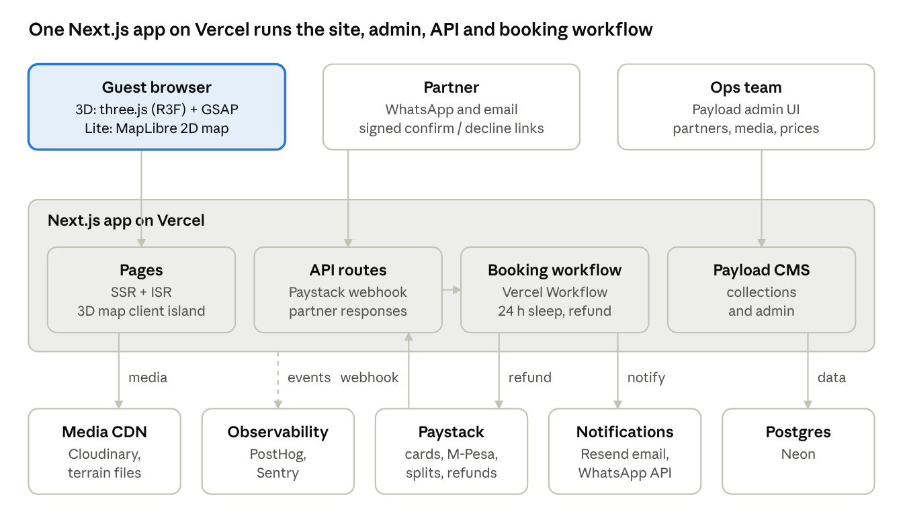
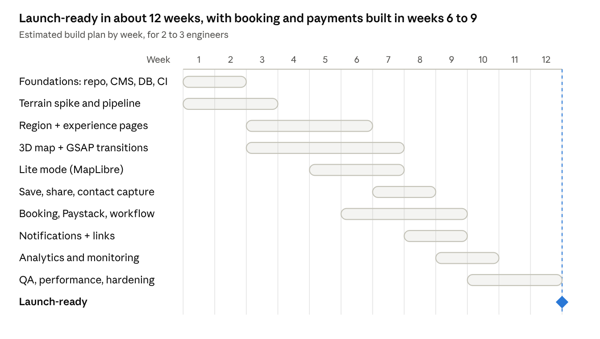

# Safarinet: Technical Build Plan

Oct 6, 2026 · @thadeus

## Summary

Build Safarinet as one Next.js App Router app on Vercel. The 3D map is a three.js scene (via React Three Fiber) with GSAP driving the camera. Payload CMS runs inside the same app as the admin tool, Postgres stores the data, Paystack takes payments, and Vercel Workflow runs the 24-hour confirm-or-refund timer.

**The key architecture call:** render the Kenya terrain ourselves in three.js from a pre-baked elevation mesh, instead of streaming Mapbox or Cesium tiles. The map shows six regions, not street-level detail, so a static mesh is enough. It removes per-map-load fees, which the PRD flags as a risk, and gives full art direction for fly-ins. Lite mode uses MapLibre GL with free vector tiles.

The plan assumes a team of 2 to 3 engineers and about 12 weeks to launch-ready. That is an estimate to check against the real team.

## Architecture



The guest browser loads terrain meshes and photos straight from the CDN. A partner's tap on a confirm or decline link hits an API route that resumes the booking workflow. All parts of the app read and write Postgres through Payload.

## Tech stack

Every choice favours one deployable app, the fewest vendors, and low costs at low traffic.

| Layer | Choice | Why |
| --- | --- | --- |
| Framework | Next.js (App Router), TypeScript, React | Server-rendered experience pages for SEO and sharing; the 3D map is a client island |
| Hosting | Vercel (Node.js runtime, Fluid Compute) | Preview deploys per branch; image CDN; cron and Workflow built in |
| 3D rendering | three.js via React Three Fiber + drei | Declarative scene in React; drei gives camera controls, loaders and `<Html>` pins |
| Animation | GSAP (core, Timeline, ScrollTrigger) | Camera fly-ins, region transitions and UI choreography with precise easing and timelines |
| Lite map | MapLibre GL JS + free vector tiles (e.g. OpenFreeMap or Protomaps) | The same pins on a flat map, with no per-load fee |
| Styling and UI | Tailwind CSS + shadcn/ui | Fast, accessible components for cards, booking forms and admin |
| Audio | Howler.js | Region music crossfades (deferred), mute state, unlock on tap |
| CMS and admin | Payload CMS 3 (runs inside Next.js) | Admin UI for partners, experiences, media, pricing, bookings and go-live status with no extra service |
| Database | Postgres (Neon via the Vercel Marketplace) + Drizzle or Payload's adapter | Relational fit for bookings, pricing and payouts; branching per preview |
| Media | Cloudinary (images and short video) | AVIF/WebP, resizing and video transcoding on the fly |
| Payments | Paystack (cards, M-Pesa, subaccount splits); Flutterwave as backup | As the PRD decides; Daraja direct M-Pesa later |
| Background jobs | Vercel Workflow | A durable `sleep("24h")` then auto-refund, with no cron polling |
| Email | Resend + React Email | Booking status emails from React templates |
| WhatsApp | Meta WhatsApp Cloud API (or Twilio) | Guest and partner notifications; partners can confirm by link from WhatsApp |
| Analytics | PostHog | Funnel events from the PRD, session replay, feature flags for lite-mode tuning |
| Errors and performance | Sentry + Vercel Speed Insights | Real-user load time by device class |
| Testing | Vitest, Playwright | Unit tests for pricing and state logic; end-to-end booking on mobile viewports |

## 3D map approach

A pre-baked three.js terrain gives the best look at the lowest running cost. Mapbox stays as a fallback if we later need real map detail.

| Option | Look and control | Cost at scale | Effort | Verdict |
| --- | --- | --- | --- | --- |
| Pre-baked three.js terrain | Full art direction; custom shaders, lighting, fog | Static files on a CDN; no per-load fee | Medium: an asset pipeline to build | **Recommended** |
| Mapbox GL JS terrain (+ three.js custom layer) | Real map detail and labels; less stylistic control | Per-map-load pricing | Low | Fallback |
| CesiumJS | Globe-accurate, heavy bundle | Cesium ion pricing | Medium-high | Not for MVP |

**How the terrain is built**

1. Download Kenya elevation data (Copernicus GLO-30 or SRTM) and satellite imagery (Sentinel-2 cloudless mosaic).
2. Crop it to Kenya, downsample, and turn it into a height-mapped mesh with Blender or a GDAL + Node script.
3. Bake one terrain at country scale plus a higher-detail tile per region for fly-ins.
4. Compress to glTF with Draco or Meshopt, and textures to KTX2. Load region tiles only when that region opens.

**Scene and motion**

- `<Canvas>` from React Three Fiber, loaded with `next/dynamic` and `ssr: false` so it never blocks the first paint.
- Region pins are drei `<Html>` elements: real DOM, so they are tappable, accessible and styled with Tailwind.
- One GSAP timeline per transition tweens camera position and target, fog and the UI panels together. The landing drift is a slow looping tween.
- Also export the landing fly-over as a short MP4 poster. It shows while the 3D scene loads, and in lite mode.
- Cap the device pixel ratio at 1.5 on phones, render on demand (`frameloop="demand"`) when idle, and pause the scene when the tab is hidden.

**Lite mode**

- Choose a mode on first load from `navigator.connection` (effectiveType, saveData), `deviceMemory`, and a GPU tier from `detect-gpu`. Store the result in a cookie.
- Lite mode renders MapLibre with the same pin and card components. The three.js bundle is never downloaded.
- A visible toggle lets anyone switch modes.

## Booking and payments

Each booking request is a durable workflow. It starts when the deposit settles and ends in a confirmation or a refund, so no request can be forgotten.

**Booking states**

| State | Entered when | Next |
| --- | --- | --- |
| `pending_payment` | The guest submits the request form; a Paystack transaction is initialised | `awaiting_partner` on a verified `charge.success` webhook; `abandoned` after 30 min |
| `awaiting_partner` | The deposit settles; the workflow starts and the partner is notified | `confirmed`, `declined`, or `expired` after 24 h |
| `confirmed` | The partner taps Confirm in a signed link | `completed` after the experience date; `cancelled` under policy |
| `declined` / `expired` | The partner declines, or the workflow's 24 h sleep ends | `refunded` once the Paystack refund webhook arrives |
| `refunded`, `completed`, `cancelled` | Terminal | — |

**Workflow sketch (Vercel Workflow)**

```ts
export async function bookingWorkflow(bookingId: string) {
  "use workflow";
  await notifyPartner(bookingId);              // WhatsApp + email, signed confirm/decline links
  const reply = await Promise.race([
    partnerReplyHook(bookingId),               // resumed by the confirm/decline endpoint
    sleep("24h").then(() => "expired" as const),
  ]);
  if (reply === "confirmed") return confirmBooking(bookingId);
  await refundDeposit(bookingId);              // Paystack refund API, idempotent
  await notifyGuest(bookingId, reply);
}
```

**Paystack integration**

- Each partner gets a Paystack subaccount, so the platform commission is split at charge time.
- Charge in KES. Show USD using a daily exchange rate cached in the database, and store the rate used on each booking.
- M-Pesa uses Paystack's mobile money channel (an STK push to the guest's phone). Cards use Paystack Inline or a redirect.
- Verify webhook signatures (HMAC SHA-512). Key handlers on the Paystack reference so they are idempotent. Never trust the browser callback alone.
- Put a small `PaymentProvider` interface between the app and Paystack, so Flutterwave failover and Daraja can be added later without touching booking logic.

**Partner confirmation without a dashboard.** Partners get a WhatsApp message and an email with two signed, single-use links: Confirm and Decline. Tapping one calls an API route that resumes the workflow. No login is needed.

## Data model

Ten core collections cover the MVP. Payload defines them, and they are stored in Postgres.

| Entity | Key fields | Notes |
| --- | --- | --- |
| Region | name, slug, camera pose (position + target), terrain tile URL, status (`live` / `coming_soon`) | Status is set by hand, and the admin warns if a live region has fewer than 5 active partners |
| Partner | name, region, contact (WhatsApp, email), Paystack subaccount code, commission %, contract signed date, response stats | Response stats feed the partner scorecard |
| Experience | partner, region, type, title, description, lat/lng, duration, media[], published | Lodges are experiences with type `stay` |
| PriceRule | experience, basis (`per_person` / `per_group`), min/max group, season date range, amount KES | Several rules per experience; the lowest valid one gives the "from" price |
| Fee | experience, kind (`vehicle`, `guide`, `conservancy`, `park_kws`), basis, amount KES | Itemised in the booking breakdown |
| Booking | experience, guest contact, date, party size, price breakdown (snapshot), total, deposit, FX rate, state, workflow run id | The price snapshot is frozen when the booking is made |
| Payment | booking, provider, reference, channel (`card` / `mpesa`), amount, status, raw webhook | One booking can have deposit, balance and refund rows |
| Itinerary | public slug, experience ids[], created from (anonymous id) | Powers save-and-share links without accounts |
| Lead | email or WhatsApp, consent at, source, itinerary | Contact capture under the Data Protection Act |
| Review | experience, rating, text, source | Imported at first; collected after completed bookings later |

Pricing logic lives in one pure TypeScript function, `quote(experience, date, partySize)`, covered by unit tests. The "from" price and the booking breakdown both call it.

## Project structure

One repo and one Next.js app. Public pages, the admin and the API share the same types.

```text
safarinet/
  app/
    (site)/
      page.tsx                     # landing: 3D map or lite map
      [region]/page.tsx            # region hub + destination cards
      [region]/[experience]/page.tsx  # experience page (SSR + ISR)
      book/[experience]/page.tsx   # request-to-book + payment
      booking/[id]/page.tsx        # guest booking status
      trip/[slug]/page.tsx         # shared itinerary
    (payload)/admin/...            # Payload admin UI
    api/
      paystack/webhook/route.ts
      partner/respond/route.ts     # signed confirm / decline links
      itinerary/route.ts
  components/
    map3d/   Scene.tsx Terrain.tsx RegionPins.tsx CameraRig.ts (GSAP)
    maplite/ LiteMap.tsx (MapLibre)
    cards/ booking/ ui/ (shadcn)
  lib/
    pricing/quote.ts               # pure, unit-tested
    payments/ provider.ts paystack.ts
    notify/ email.tsx whatsapp.ts
    device/ detectMode.ts
  workflows/booking.ts
  collections/                     # Payload collections
  scripts/terrain/                 # DEM -> glTF pipeline
  public/terrain/                  # compressed meshes + KTX2 (or Blob/CDN)
```

Experience and region pages are server-rendered with incremental revalidation, so they load fast and preview well when shared on WhatsApp and social media. Only the map is client-rendered.

## Performance budgets and asset pipeline

These budgets are proposed starting points. Tune them with real-user data in the first weeks after launch.

| Budget | 3D mode | Lite mode |
| --- | --- | --- |
| JS on first load (gzipped) | ≤ 350 KB, with three.js and GSAP split out | ≤ 170 KB, no three.js |
| Data before the map is interactive | ≤ 3 MB (country mesh + textures) | ≤ 600 KB |
| Time to interactive map | ≤ 4 s on a mid-range Android over Wi-Fi | ≤ 5 s on a mid-range Android over 3G |
| Frame rate | ≥ 30 fps on a mid-range Android; 60 fps on desktop | n/a |
| Experience page LCP | ≤ 2.5 s (75th percentile) | ≤ 2.5 s |

**Asset pipeline**

- Terrain: run a GDAL script to produce a heightmap, then a mesh in Blender or Node, then gltf-transform (Meshopt, KTX2), then upload to the CDN with immutable cache headers.
- Images: partners' and our photos go to Cloudinary and are served as AVIF/WebP with `next/image` and responsive sizes.
- Video: short loops of 6 to 10 s, transcoded to 720p H.264 and WebM, `muted playsInline`, loaded only once they scroll into view.
- Fonts: one variable font loaded with `next/font`. No icon fonts.

## Testing, deployment and monitoring

The money path gets the most testing: pricing, webhooks, the 24-hour timer and refunds.

- **Unit (Vitest):** `quote()` across seasons, group sizes and fees; booking state transitions; webhook signature checks.
- **End to end (Playwright):** the full flow from map to booking request on iPhone and mid-range Android viewports, with Paystack test keys. Also the forced-lite path, a shared itinerary link, and partner confirm and decline.
- **Workflow tests:** shorten the sleep to seconds in the test environment to exercise expiry and auto-refund.
- **Visual and performance:** Lighthouse CI on experience pages; a weekly manual pass on a real mid-range Android over throttled 3G.
- **Deploys:** GitHub to Vercel. Every PR gets a preview with a Neon branch database and Paystack test mode. `main` deploys to production, behind a Rolling Release for risky changes.
- **Monitoring:** Sentry for errors and failed webhooks. PostHog dashboards for the PRD success metrics. An alert when a booking sits in `awaiting_partner` for more than 20 h, or when a refund fails.

## Build plan

The terrain spike in weeks 1 to 3 is the first go/no-go: if a mid-range Android can't hold 30 fps, fall back to Mapbox before investing in the 3D map.



Partner signing and legal sign-off (PRD Phase 0) run in parallel and gate the public launch, not the build. Use Paystack test mode until legal clears live payments.

## Decisions to make before building

- [ ] Confirm the pre-baked three.js terrain over Mapbox. Run a one-week spike on a mid-range Android first.
- [ ] Payload CMS or a hand-built admin: Payload is faster to start, while a custom admin is lighter to run.
- [ ] WhatsApp provider: Meta Cloud API directly (cheaper; needs business verification) or Twilio (faster setup).
- [ ] Deposit size, and whether the balance is collected online or paid to the partner on the day. This decides whether we need a second Paystack charge.
- [ ] Exchange-rate source, and who absorbs swings between quote and settlement.
- [ ] Team size and the launch date, to firm up the 12-week estimate.
